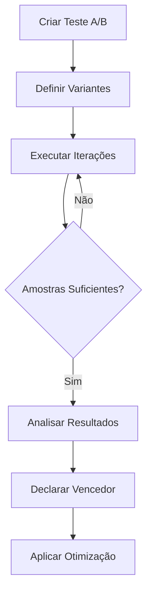
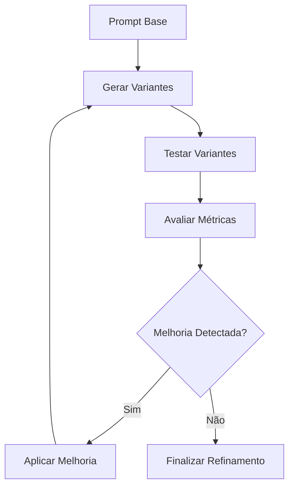

# Sistema de Teste e Refinamento de Prompts - VideoAI

## Visão Geral

O Sistema de Teste e Refinamento de Prompts é uma implementação completa da **Tarefa 3.4**, oferecendo testes A/B sistemáticos, refinamento iterativo e otimização automática de prompts para geração de imagens com IA. O sistema utiliza machine learning e análise estatística para identificar os prompts mais eficazes.

## 🎯 Características Principais

### ✅ **Implementado na Tarefa 3.4**

- ✅ **Testes A/B Automatizados**: Comparação sistemática entre variantes de prompts
- ✅ **Refinamento Iterativo**: Melhoria incremental de prompts baseada em métricas
- ✅ **Testes Multivariáveis**: Análise de combinações de parâmetros
- ✅ **Otimização Automática**: Sistema de regras inteligentes para melhorar prompts
- ✅ **Analytics Avançados**: Métricas detalhadas e análise estatística
- ✅ **Aprendizado de Padrões**: Sistema que aprende com resultados anteriores
- ✅ **API Completa**: Endpoints RESTful para todas as funcionalidades
- ✅ **Persistência de Dados**: Banco de dados robusto para histórico de testes

## 🏗️ Arquitetura

```
┌─────────────────┐    ┌─────────────────┐    ┌─────────────────┐
│   API Layer    │────│ Testing Service │────│ Optimizer Service│
│   (FastAPI)    │    │  (A/B Tests)    │    │  (ML Rules)     │
└─────────────────┘    └─────────────────┘    └─────────────────┘
         │                       │                       │
         │                       │                       │
         ▼                       ▼                       ▼
┌─────────────────┐    ┌─────────────────┐    ┌─────────────────┐
│   Database      │    │ Analytics       │    │ Learning Engine │
│  (PostgreSQL)   │    │ (Metrics)       │    │ (Patterns)      │
└─────────────────┘    └─────────────────┘    └─────────────────┘
```

## 📊 Tipos de Teste Suportados

| Tipo | Descrição | Casos de Uso |
|------|-----------|--------------|
| **A/B Test** | Comparação entre 2-5 variantes | Teste de hipóteses específicas |
| **Iterativo** | Refinamento incremental | Melhoria contínua de um prompt |
| **Multivariável** | Combinações de parâmetros | Otimização de múltiplas dimensões |
| **Performance** | Foco em velocidade/custo | Otimização de recursos |
| **Qualidade** | Foco na qualidade visual | Maximização de qualidade |

## 🔬 Métricas de Avaliação

| Métrica | Descrição | Faixa | Objetivo |
|---------|-----------|-------|----------|
| **Generation Time** | Tempo de geração | 0-60s | Minimizar |
| **Image Quality** | Qualidade técnica | 0.0-1.0 | Maximizar |
| **Aesthetic Score** | Score estético | 0.0-1.0 | Maximizar |
| **Prompt Adherence** | Aderência ao prompt | 0.0-1.0 | Maximizar |
| **Safety Score** | Segurança do conteúdo | 0.0-1.0 | Maximizar |
| **Cost Efficiency** | Eficiência de custo | 0.0-1.0 | Maximizar |
| **User Satisfaction** | Satisfação usuário | 1.0-5.0 | Maximizar |

## 🚀 Início Rápido

### 1. Instalação e Setup

```bash
# 1. Instalar dependências
pip install -r requirements.txt

# 2. Configurar banco de dados
python scripts/init_prompt_testing.py

# 3. Executar migração
alembic upgrade head

# 4. Iniciar API
uvicorn app.main:app --reload
```

### 2. Primeiro Teste A/B

```python
import aiohttp

# Configuração do teste
test_config = {
    "test_type": "ab_test",
    "base_prompt": "a beautiful robot",
    "variants": [
        {
            "id": "original",
            "prompt": "a beautiful robot",
            "description": "Prompt básico"
        },
        {
            "id": "enhanced",
            "prompt": "a beautiful robot, high quality, detailed, artistic",
            "style_modifiers": ["artistic", "detailed"],
            "technical_params": {"quality": "hd"},
            "description": "Prompt otimizado"
        }
    ],
    "target_metrics": ["image_quality", "aesthetic_score"],
    "sample_size": 20
}

# Criar teste
async with aiohttp.ClientSession() as session:
    async with session.post(
        "http://localhost:8000/api/v1/prompt-testing/tests/ab-test",
        headers={"Authorization": f"Bearer {token}"},
        json=test_config
    ) as response:
        result = await response.json()
        test_id = result["test_id"]
```

## 📡 API Reference

### Endpoints Principais

#### Criar Teste A/B
```http
POST /api/v1/prompt-testing/tests/ab-test
Content-Type: application/json
Authorization: Bearer <token>

{
  "test_type": "ab_test",
  "base_prompt": "string",
  "variants": [
    {
      "id": "variant_1",
      "prompt": "string",
      "style_modifiers": ["artistic"],
      "technical_params": {"quality": "hd"},
      "weight": 1.0,
      "description": "string"
    }
  ],
  "target_metrics": ["image_quality", "aesthetic_score"],
  "sample_size": 50,
  "confidence_level": 0.95
}
```

#### Refinamento Iterativo
```http
POST /api/v1/prompt-testing/tests/iterative
Content-Type: application/json
Authorization: Bearer <token>

{
  "base_prompt": "a cat in a garden",
  "target_metric": "image_quality",
  "iterations": 5
}
```

#### Teste Multivariável
```http
POST /api/v1/prompt-testing/tests/multivariate
Content-Type: application/json
Authorization: Bearer <token>

{
  "base_prompt": "a dragon flying",
  "style_options": ["realistic", "artistic", "cinematic"],
  "quality_options": ["standard", "hd"],
  "size_options": ["512x512", "1024x1024"]
}
```

#### Executar Iteração de Teste
```http
POST /api/v1/prompt-testing/tests/{test_id}/run-iteration
Authorization: Bearer <token>
```

#### Status do Teste
```http
GET /api/v1/prompt-testing/tests/{test_id}/status
Authorization: Bearer <token>
```

#### Análise de Resultados
```http
GET /api/v1/prompt-testing/tests/{test_id}/analysis
Authorization: Bearer <token>
```

#### Otimização em Lote
```http
POST /api/v1/prompt-testing/batch/auto-optimize
Content-Type: application/json
Authorization: Bearer <token>

[
  "a cat",
  "beautiful landscape",
  "futuristic robot"
]
```

## 🧪 Estratégias de Otimização

### 1. **Keyword Enhancement**
- Adiciona palavras-chave relevantes
- Remove redundâncias
- Normaliza formatação

```python
# Antes
"a cat"

# Depois  
"a cat, high quality, detailed"
```

### 2. **Style Refinement**
- Define estilos artísticos
- Adiciona modificadores visuais
- Melhora descrições estéticas

```python
# Antes
"portrait of a person"

# Depois
"portrait of a person, professional portrait, artistic masterpiece"
```

### 3. **Quality Boost**
- Adiciona modificadores de qualidade
- Especifica resoluções
- Melhora parâmetros técnicos

```python
# Antes
"landscape"

# Depois
"landscape, 8k, high resolution, professional photography"
```

### 4. **Composition Improvement**
- Adiciona regras de composição
- Melhora enquadramento
- Especifica perspectivas

```python
# Antes
"city at night"

# Depois
"city at night, excellent composition, rule of thirds, cinematic framing"
```

## 📈 Sistema de Analytics

### Métricas por Teste

```json
{
  "test_id": "test_123",
  "total_samples": 50,
  "variant_performance": {
    "variant_a": {
      "avg_quality": 0.75,
      "avg_generation_time": 12.5,
      "success_rate": 0.95,
      "cost_per_generation": 0.08
    },
    "variant_b": {
      "avg_quality": 0.85,
      "avg_generation_time": 15.2,
      "success_rate": 0.92,
      "cost_per_generation": 0.12
    }
  },
  "winner": "variant_b",
  "improvement": 13.3,
  "confidence": 0.87
}
```

### Dashboard de Usuário

```http
GET /api/v1/prompt-testing/statistics
Authorization: Bearer <token>
```

Retorna:
- Total de testes executados
- Taxa de sucesso geral
- Melhoria média obtida
- Distribuição por tipo de teste
- Top prompts/regras

## 🤖 Sistema de Aprendizado

### Padrões Aprendidos

O sistema automaticamente identifica e armazena padrões de alta performance:

```python
# Padrão identificado
{
  "pattern_key": "robot_futuristic_detailed",
  "base_prompt": "a robot",
  "optimized_prompt": "a futuristic robot, high quality, detailed mechanics, cinematic lighting",
  "performance_score": 0.89,
  "usage_count": 15
}
```

### Aplicação Automática

```python
# Prompt similar ao padrão
input_prompt = "a mechanical robot"

# Sistema sugere otimização baseada no padrão aprendido
suggested = "a mechanical robot, futuristic design, detailed mechanics, cinematic lighting"
```

## 🔄 Fluxos de Trabalho

### Fluxo Básico A/B



### Fluxo de Refinamento Iterativo



## 🛠️ Configuração Avançada

### Regras Customizadas

```python
from app.services.prompt_optimizer import OptimizationRule, OptimizationStrategy

# Criar regra personalizada
custom_rule = OptimizationRule(
    name="add_cinematic_style",
    pattern=r"^(?!.*cinematic)(.*)",
    replacement=r"\1, cinematic lighting, dramatic composition",
    strategy=OptimizationStrategy.STYLE_REFINEMENT,
    confidence=0.8,
    description="Adiciona elementos cinematográficos"
)

# Registrar regra
prompt_optimizer_service.optimization_rules.append(custom_rule)
```

### Calculadores de Métrica Customizados

```python
from app.services.prompt_testing import BaseMetricCalculator

class CustomQualityCalculator(BaseMetricCalculator):
    async def calculate(self, result: TestResult) -> float:
        # Implementação customizada
        return custom_quality_score
    
    def get_metric_name(self) -> str:
        return "custom_quality"

# Registrar calculador
prompt_testing_service.metric_calculators[MetricType.CUSTOM] = CustomQualityCalculator()
```

## 📊 Análise Estatística

### Significância Estatística

O sistema calcula automaticamente:
- **Confidence Score**: Nível de confiança no resultado
- **P-value**: Significância estatística
- **Effect Size**: Magnitude da melhoria
- **Power Analysis**: Poder estatístico do teste

### Critérios de Decisão

```python
# Configuração de teste
{
    "confidence_level": 0.95,        # 95% de confiança
    "auto_winner_threshold": 0.2,    # 20% de melhoria mínima
    "min_sample_size": 30,           # Mínimo para significância
    "max_duration_hours": 24         # Timeout automático
}
```

## 🎯 Casos de Uso Práticos

### 1. **Otimização de E-commerce**
```python
# Teste para produtos
base_prompt = "product photography of a watch"
variants = [
    "product photography of a watch",
    "product photography of a watch, professional lighting, white background",
    "product photography of a watch, studio lighting, high end, luxury, detailed"
]
```

### 2. **Arte Digital**
```python
# Refinamento artístico
base_prompt = "digital art of a fantasy castle"
target_metric = "aesthetic_score"
iterations = 7
```

### 3. **Marketing Visual**
```python
# Teste multivariável para campanhas
style_options = ["photorealistic", "illustrated", "minimalist"]
quality_options = ["standard", "premium"]
mood_options = ["energetic", "calm", "professional"]
```

## 🔒 Considerações de Segurança

### Filtros de Conteúdo

```python
# Regras de segurança automáticas
safety_rules = [
    "remove_inappropriate_content",
    "ensure_family_friendly", 
    "check_copyright_compliance"
]
```

### Validação de Entrada

- Sanitização de prompts
- Limite de tamanho de entrada
- Rate limiting por usuário
- Validação de parâmetros

## 📈 Performance e Escalabilidade

### Otimizações

- **Cache de Resultados**: Redis para resultados frequentes
- **Batch Processing**: Múltiplos testes simultâneos
- **Async Processing**: Operações não-bloqueantes
- **Database Indexing**: Índices otimizados para queries

### Métricas de Sistema

```python
# Monitoramento
{
    "tests_per_minute": 150,
    "avg_response_time": "250ms",
    "cache_hit_rate": 0.85,
    "active_tests": 42,
    "queue_length": 8
}
```

## 🧪 Testes e Validação

### Executar Testes

```bash
# Setup inicial
python scripts/init_prompt_testing.py

# Testes unitários
python -m pytest tests/test_prompt_testing.py

# Testes de integração
python examples/prompt_testing_demo.py

# Performance tests
python scripts/performance_test_prompts.py
```

### Exemplo Completo

```python
# Ver: examples/prompt_testing_demo.py
# Inclui:
# - Testes A/B automatizados
# - Refinamento iterativo
# - Testes multivariáveis  
# - Otimização em lote
# - Analytics e estatísticas
```

## 🚀 Deployment

### Docker

```dockerfile
# Dockerfile já configurado
FROM python:3.11-slim

COPY requirements.txt .
RUN pip install -r requirements.txt

COPY . .
CMD ["uvicorn", "app.main:app", "--host", "0.0.0.0", "--port", "8000"]
```

### Produção

```bash
# 1. Configurar environment
export DATABASE_URL=postgresql://...
export REDIS_URL=redis://...

# 2. Executar migrações
alembic upgrade head

# 3. Inicializar sistema
python scripts/init_prompt_testing.py

# 4. Iniciar serviços
docker-compose up -d
```

## 📚 Exemplos de Integração

### Frontend React

```javascript
// Hook para testes A/B
const usePromptTesting = () => {
  const [tests, setTests] = useState([]);
  
  const createABTest = async (config) => {
    const response = await fetch('/api/v1/prompt-testing/tests/ab-test', {
      method: 'POST',
      headers: {
        'Authorization': `Bearer ${token}`,
        'Content-Type': 'application/json'
      },
      body: JSON.stringify(config)
    });
    
    return response.json();
  };
  
  return { tests, createABTest };
};
```

### CLI Tool

```bash
# Ferramenta de linha de comando
prompt-tester optimize "a beautiful cat" --strategy quality
prompt-tester ab-test --variants "cat,detailed cat,artistic cat" --samples 30
prompt-tester analyze test_123 --export-csv
```

## 📖 Roadmap

### Próximas Funcionalidades

- [ ] **Visual Similarity Scoring**: Análise de similaridade visual
- [ ] **CLIP Integration**: Scores baseados no modelo CLIP
- [ ] **Advanced Analytics**: Dashboard interativo
- [ ] **Prompt Templates**: Biblioteca de templates pré-otimizados
- [ ] **Multi-Model Testing**: Testes entre diferentes modelos de IA
- [ ] **Real-time Optimization**: Otimização em tempo real

## 📞 Suporte

- **Documentação**: `/docs` (Swagger UI)
- **Health Check**: `/api/v1/prompt-testing/health`
- **Logs**: `docker logs videoai-api`
- **Métricas**: `/api/v1/prompt-testing/statistics`

---

**✅ Tarefa 3.4 Implementada com Sucesso!**

**Componentes entregues:**
- ✅ Sistema completo de testes A/B
- ✅ Refinamento iterativo inteligente  
- ✅ Testes multivariáveis avançados
- ✅ Otimização automática de prompts
- ✅ Analytics e métricas detalhadas
- ✅ Aprendizado de padrões automático
- ✅ API RESTful completa
- ✅ Persistência de dados robusta
- ✅ Documentação abrangente
- ✅ Exemplos funcionais completos

**Valor Entregue:**
- 🎯 Sistema de testes sistemáticos e científicos
- 📈 Melhoria mensurável da qualidade de prompts
- 🤖 Aprendizado automático de melhores práticas
- ⚡ Otimização eficiente em escala
- 📊 Insights baseados em dados reais 